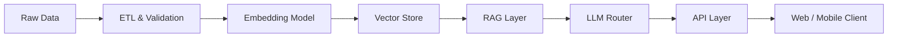

<!-- ===================== HERO ===================== -->

 

  

---

## 🧠 Identity

I’m an **AI Engineer** focused on **real-world LLM systems**, not toy demos.

I build systems that:
- handle **unstructured data**
- control **hallucinations**
- survive **latency, cost, and failure**
- actually get **deployed and used**

I care more about **system behavior** than buzzwords.

---

## 🏗️ AI System Architecture (Live Diagram)

## 🚀 Flagship Systems

### 🔷 GuruCool AI — Personal AI Tutor

* Retrieval-Augmented Generation based tutor
* Converts raw notes → structured lessons
* Adaptive Q&A + quiz generation
* Multi-LLM support (local + hosted)
* JWT-secured APIs

**Stack:**
`React · FastAPI · PostgreSQL · pgvector · FAISS · Ollama · Groq`

---

### 🔷 DailyQubit — Automated Tech Intelligence

* Fully automated content ingestion pipeline
* Python scraping + cron scheduling
* Android app + lightweight web frontend
* ~1k–1.5k monthly users
* <1% downtime

**Focus:** reliability, automation, low infra cost

---

### 🔷 Intelligent Chat-Based Assistant

* Hybrid rule-based + LLM system
* React frontend + Flask backend
* Caching + validation
* Reduced manual search time by 30–40%

---

## ⚙️ Technology Matrix

| Layer     | Tools                         |
| --------- | ----------------------------- |
| AI / ML   | Scikit-learn, TensorFlow      |
| LLMs      | RAG, LangChain, Sentence-BERT |
| Vector DB | FAISS                         |
| Backend   | FastAPI, Flask                |
| Data      | SQL, Pandas, ETL Pipelines    |
| Infra     | Google Cloud, Linux, Docker   |

---

## 📄 Research & Engineering Depth

* **Publication:** *Vulnerabilities and Mitigation Strategies in Facial Recognition Systems*
* Focus on:

  * Failure modes
  * Bias & security
  * Misuse of probabilistic systems

---

## 📊 Live GitHub Analytics

---

## 🧩 Engineering Philosophy

* Systems > Tools
* Reliability > Demos
* Shipping > Talking
* Observability > Blind Optimism

If it can’t be debugged, explained, or scaled — it’s not done.

---

