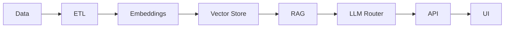

<!-- ===================== HERO ===================== -->
<div align="center">


<br/>


<br/><br/>

<a href="https://udaygarg.com">
  
</a>
<a href="https://linkedin.com/in/tigerhooduday">
  
</a>
<a href="https://github.com/tigerhooduday">
  
</a>

</div>

---

## ⚡ Focus

```txt
• Production-grade AI systems
• LLMs beyond demos
• Data → Intelligence → Deployment
````

---

## 🏗️ System View



---

## 🚀 Selected Work

### ▪ GuruCool AI

`RAG-based AI Tutor`

* Structured learning from raw notes
* Multi-LLM support · Secure APIs

### ▪ DailyQubit

`Automated Tech Intelligence`

* Python pipelines · Cron automation
* Android + Web · Live users

### ▪ Chat Assistant

`Hybrid AI System`

* Rule-based + LLM
* Low latency · Cached responses

---

## 🧪 Stack Snapshot

```txt
AI / ML        → Scikit-learn, TensorFlow
LLMs           → RAG, LangChain, Sentence-BERT
Vector Search  → FAISS
Backend        → FastAPI, Flask
Data           → SQL, Pandas, ETL
Infra          → GCP, Linux, Docker
```

---

## 📄 Research

```txt
Facial Recognition — Vulnerabilities & Mitigation
(Failure modes • Security • Bias)
```

---

## 📊 Activity

<div align="center">


</div>

---

## 🧩 Signal

```txt
Systems > Tools
Reliability > Demos
Shipping > Noise
```

---

<div align="center">


</div>
